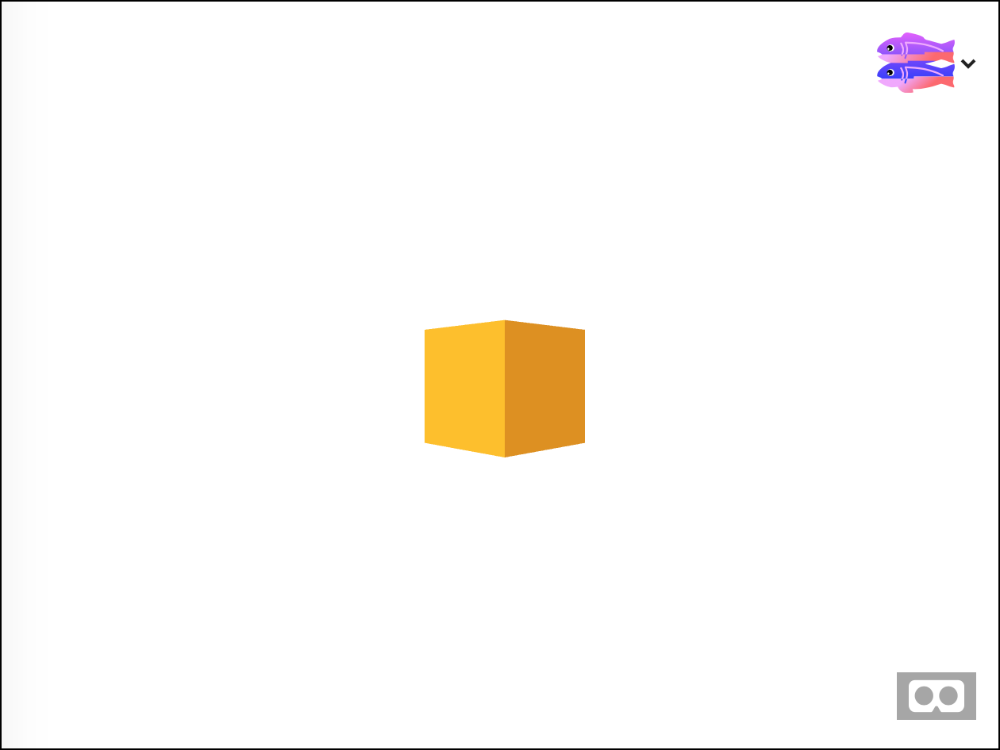
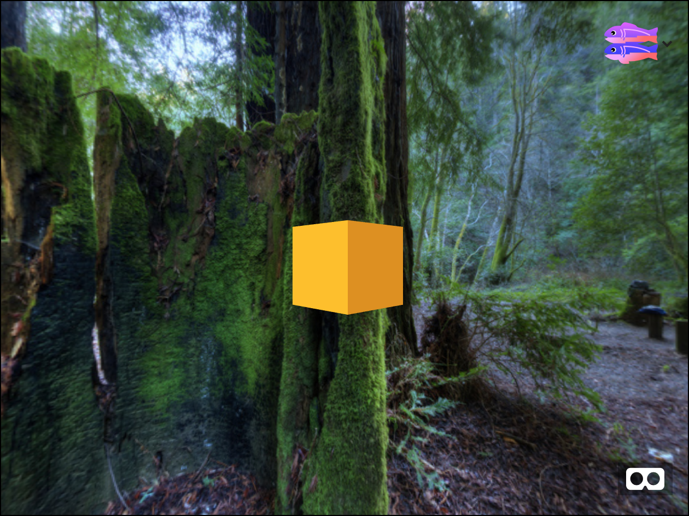
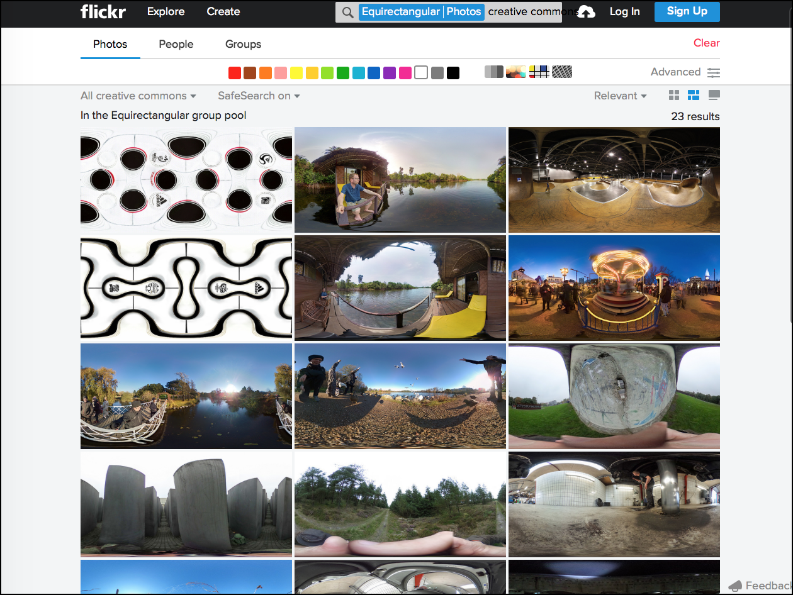
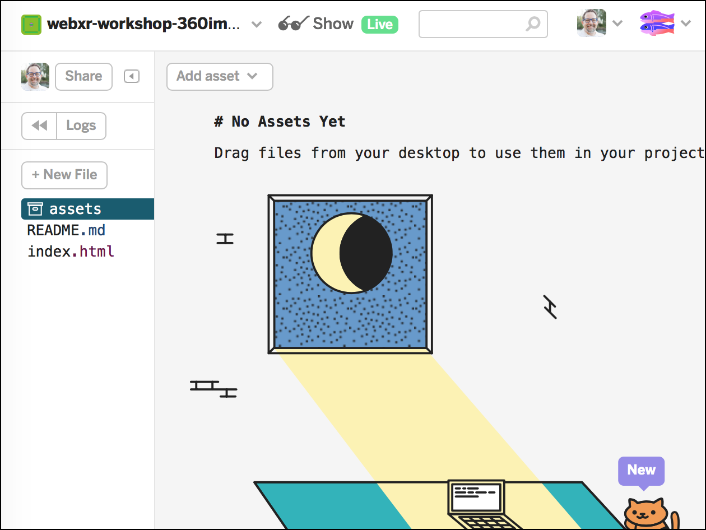
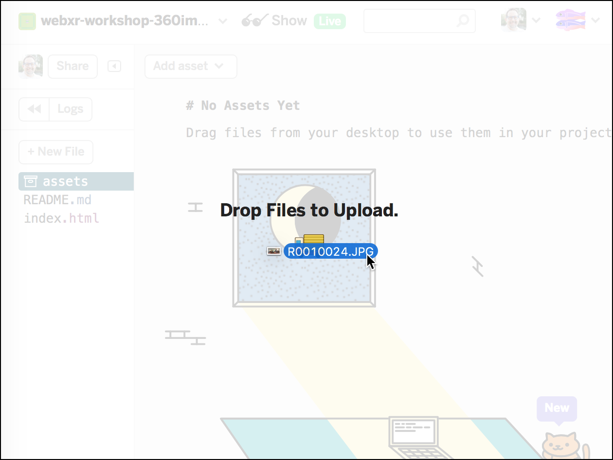
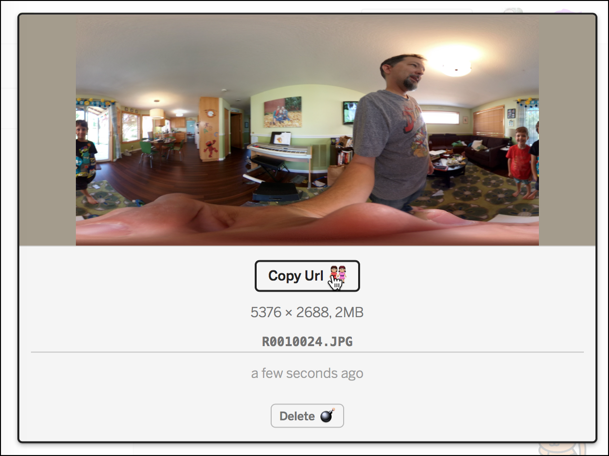
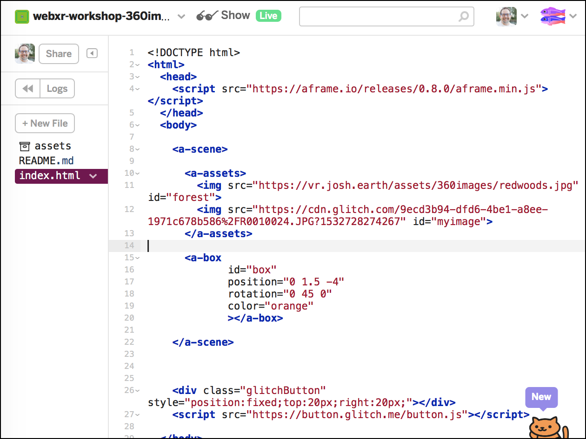

# 360 Images

In this workshop you will learn how to add 360 images and videos to an A-Frame scene. 360 Images
are also called panoramas or equirectangular images. They are created by a 360 degree camera,
usually containing two super wide fisheye lenses which are stitched together to create a
wrap around image that completely surrounds the viewer. 360 Images are a great way to
bring the real world into Virtual Reality experiences.

## A 360 Sky

Start by remixing [this glitch project](https://webxr-workshop-360images.glitch.me). When you view this project you will see a blank
white room containing an orange cube. Our goal is to add some 360 images to this scene.



First, begin editing the `index.html` file.  At the top is an `a-assets` section. This is where we will put the images, videos, and any other objects we want to load into the scene (sounds, 3d models, etc.) Begin by adding a reference to this panorama of a forest by [Bob Dass](https://www.flickr.com/photos/54144402@N03/15667611984).

```
<a-assets>
  
</a-assets>
```

Now the image will be loaded into the project but we still aren't using it. Add an `a-sky` element which references the image using `#forest`.  This reference is a CSS selector. It means *find the element with an id of 'forest'*, which will match our image of the redwoods.

```
<a-sky src="#forest"></a-sky>
```

Now press the *show* button to see your scene. It should look like this:



Believe it or not, that is all you have to do to include a 360 image in your scene.  Now comes the tricky part: finding or creating 360 images.

## Equirectangular Images

360 images are in a format called [*equirectangular*](https://en.wikipedia.org/wiki/Equirectangular_projection). This format takes the 360 degrees of a spherical image and flattens it onto a 2 by 1 rectangle. Another word for it is cylindrical projection, as this project is sometimes used to map a globe of the earth into a flat map. In fact, one of my favorite equirectanglar images is [this view of earth](https://commons.wikimedia.org/wiki/File:Equirectangular_projection_SW.jpg) with the clouds removed.


Equirectangular images are often used as a texture for spheres in 3D worlds. If I was to make a model of the moon I would use such an image.  360 images are the same, except that they are captured from inside of a sphere instead of outside.  The `a-sky` component really is just a large sphere with the texture drawn on the inside, which is why we can see it.

If you want to find free to use 360 images on the web try searching for `creative commons equirectangular`.  One of my favorite resources is this [flickr group](https://www.flickr.com/search/?group_id=44671723%40N00&view_all=1&text=creative%20commons&license=2%2C3%2C4%2C5%2C6%2C9). As you can see, there are a lot of people taking interesting images.



Please do remember that these are the creations of these artists. Each image has a license explaining how you should use the image. In many cases the artist simply wants credit and a link back to their site. They are creators, just like you, so *please always follow the artists wishes*.

## 360 cameras

If you want to make your own 360 images you can get a 360 camera. These have come down in price and can be had for as little as 100 USD. Many of these cameras have smartphone apps to control the camera and use your phone as a viewfinder.  In almost all cases you can get the images off of the camera by plugging it into your computer as a USB drive then drag the images off.

Internally the camera probably takes the images as two spherical images, which look like this:

*image*

Some cameras may automatically convert the spherical images into equirectanglar format. Others may require you to convert them manually using software on your computer.  In either case, the format you want for putting into your A-Frame scene is *equirectangular*.

Once you have your equirectangular image ready you can upload it directly into your glitch project from your desktop. Every glitch project has an *assets* section.



To upload the image, go to the assets section, drag the image to the webpage, then click on the uploaded image. It will give you a URL for the image hosted on Glitch's CDN.





Copy this CDN url then paste it into the a-assets section of your scene as a new image like this:



And that's it. Now your image is hosted on Glitch's lightning fast CDN.

## 360 vs 180 vs 3D


Some cameras may say they are 180 instead of 360. Others may say they are 3D and also 180 or 360. These are not all the same things. Here's the difference

* 360 means the image wraps around the camera a full 360 degrees. It may or may not be 3D however. In most cases 360 will not be 3D because there was only one camera taking an image from only one spot. To be 3D there must be two lenses (roughly) as far apart as human eyes.

* 180 means the image wraps only 180 degrees around the camera. As you can guess this is half the angular size as 360. If you take a 180 picture pointed in front of you it will also cover part of the sides, but not behind you.  This is both a good and bad thing . 180 images are half the download size and memory as 360 (or alternatively, have twice as much detail as 360 images), but they only cover half the scene.  For images the difference might not be a big deal, but for video the bandwidth savings can be significant.

* 3D means two pictures are taken a few inches apart. These pictures may be combined into a single image, but they must be split apart again when drawing to the screen. In order to see these images in 3D the user must actually have some sort of a 3D headsets or glasses.  

Everything in this workshop applies to 360 imagery. 180 and 3D images will be covered in another workshop.

### 360 Video

360 video works the same way as static images. Upload an equirectangular video in a format the browser understands (likely Mpeg4), add it to your `a-sky` and it should work.  However, 360 video is *extremely* bandwidth intensive, as much as one gigabyte per minute. If you want to use 360 video in a project you should use a CDN (content delivery network) that supports streaming 360 video like [Vimeo](https://vimeo.com/blog/post/introducing-vimeo-360). Hosting it on your own webserver may be difficult.


## summary

In this workshop you learned what 360 images are, how to add them to a scene, and how to upload your own from a 360 camera.
